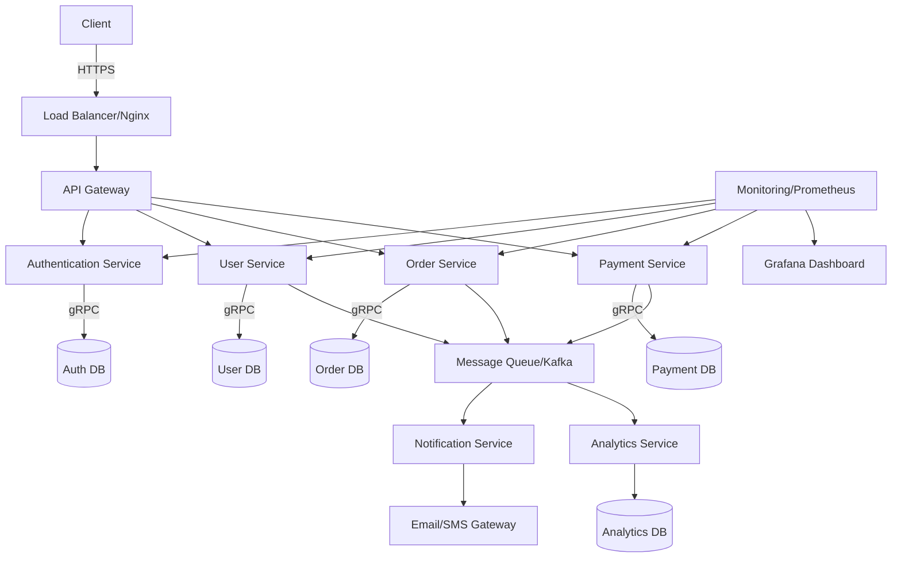
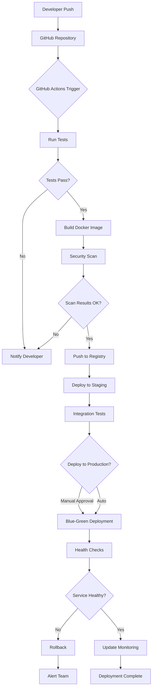
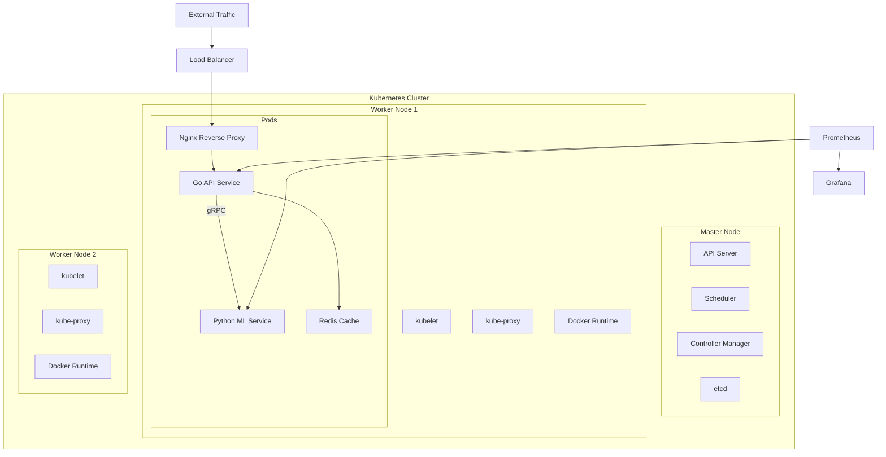
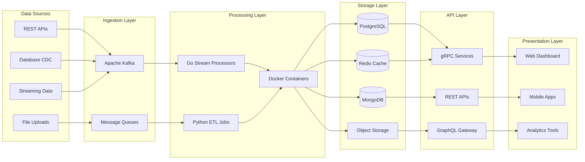
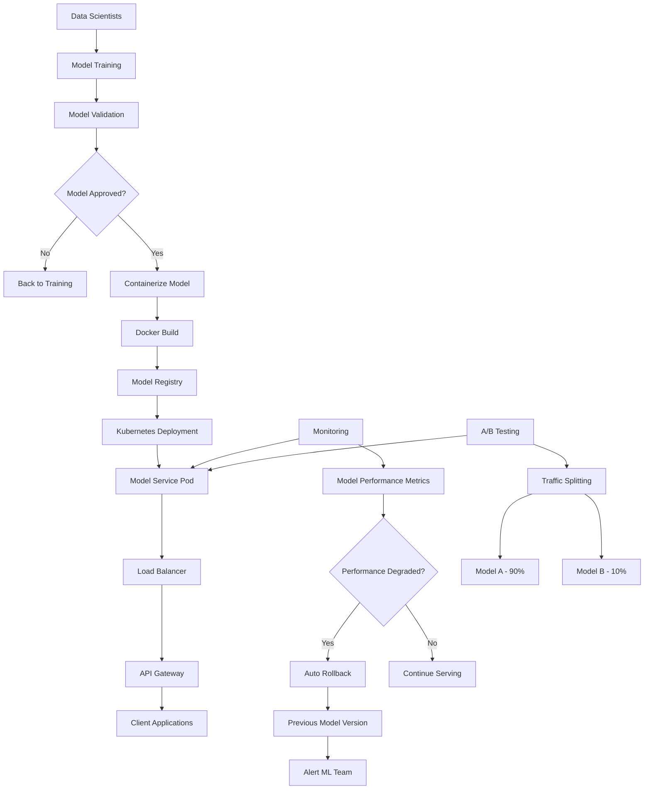
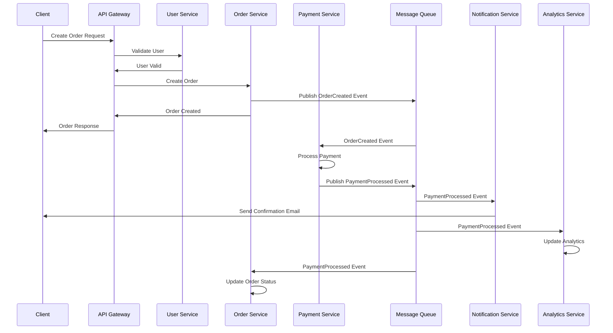

# Welcome to My GitHub Portfolio

This portfolio showcases my expertise in developing cutting-edge applications, leveraging a variety of programming languages, frameworks, and innovative techniques. Here's what you can expect:

## 🌟 Key Technologies

### Programming Languages
- **Go (Golang)**: Building high-performance, concurrent backend services and microservices architecture
- **TypeScript & JavaScript**: Creating robust and scalable front-end and back-end solutions
- **Python**: Developing automated workflows, machine learning models, and data pipelines
- **HTML & Web Development**: Crafting intuitive user interfaces and seamless user experiences

### Backend & Infrastructure
- **Docker**: Containerizing applications for consistent deployment across environments
- **Nginx**: Implementing reverse proxy, load balancing, and web server configurations
- **gRPC**: Building efficient, type-safe APIs for microservices communication
- **REST APIs**: Designing and implementing RESTful web services
- **Microservices Architecture**: Creating scalable, distributed systems

### Databases & Storage
- **PostgreSQL**: Relational database design and optimization
- **MongoDB**: NoSQL document-based database solutions
- **Redis**: In-memory data structures for caching and session management
- **Database Migration**: Schema versioning and data transformation strategies

### DevOps & Cloud
- **Kubernetes**: Container orchestration and cluster management
- **CI/CD Pipelines**: Automated testing, building, and deployment workflows
- **GitHub Actions**: Continuous integration and deployment automation
- **AWS/GCP/Azure**: Cloud infrastructure and services integration
- **Terraform**: Infrastructure as Code (IaC) for cloud resource management

### Monitoring & Observability
- **Prometheus**: Metrics collection and monitoring
- **Grafana**: Data visualization and dashboard creation
- **Docker Compose**: Multi-container application orchestration
- **Logging**: Structured logging and log aggregation systems

## 🛠️ Development Approach

### System Design & Architecture
- **Microservices Patterns**: Implementing service mesh, API gateways, and distributed systems
- **Event-Driven Architecture**: Using message queues and event streaming for scalable applications
- **Load Balancing**: Distributing traffic efficiently across multiple service instances
- **Caching Strategies**: Implementing multi-level caching for optimal performance

### Automated Processes
- **Container Orchestration**: Automating deployment, scaling, and management of containerized applications
- **Infrastructure Automation**: Provisioning and managing cloud resources programmatically
- **Workflow Automation**: Developing tools to streamline development and deployment processes
- **Data Pipeline Automation**: Creating automated ETL processes and data transformation workflows

### AI and Machine Learning
- **Model Deployment**: Containerizing and deploying ML models using Docker and Kubernetes
- **Training Pipeline Automation**: Implementing MLOps practices for model training and versioning
- **Retrieval-Augmented Generation (RAG)**: Building AI-powered search and knowledge systems
- **Fine-tuning Pipelines**: Optimizing machine learning models for specialized applications

### Performance & Scalability
- **Concurrent Programming**: Leveraging Go's goroutines and channels for high-performance applications
- **API Optimization**: Implementing efficient data serialization with Protocol Buffers and gRPC
- **Database Optimization**: Query optimization, indexing strategies, and connection pooling
- **Caching Solutions**: Redis integration for session management and data caching

## 📚 Development Best Practices

### Code Quality & Testing
- **Test-Driven Development**: Comprehensive unit, integration, and end-to-end testing
- **Code Reviews**: Maintaining high code quality through peer review processes
- **Static Analysis**: Using linters and code analysis tools for consistent code standards
- **Security Practices**: Implementing secure coding practices and vulnerability scanning

### Documentation & Collaboration
- **API Documentation**: Comprehensive API documentation using OpenAPI/Swagger specifications
- **Technical Documentation**: Detailed system architecture and deployment guides
- **Code Documentation**: Well-documented codebases for maintainability and team collaboration
- **Runbooks**: Operational documentation for system maintenance and troubleshooting

### Version Control & Deployment
- **Git Workflows**: Implementing GitFlow and feature branch strategies
- **Container Registries**: Managing Docker images and container versioning
- **Blue-Green Deployments**: Zero-downtime deployment strategies
- **Rollback Strategies**: Implementing safe deployment rollback mechanisms

## 🚀 Featured Project Areas

### Cloud-Native Applications
- **Kubernetes-native applications** with custom controllers and operators
- **Serverless architectures** using cloud functions and event-driven patterns
- **Multi-cloud deployment strategies** with portable containerized solutions

### High-Performance APIs
- **gRPC services** with Protocol Buffer schema definitions
- **GraphQL implementations** for flexible data querying
- **Real-time communication** using WebSockets and Server-Sent Events

### Data Engineering
- **Stream processing** with Apache Kafka and event-driven architectures
- **Data visualization dashboards** using modern charting libraries
- **ETL pipelines** for data transformation and migration

Whether it's architecting scalable microservices, implementing robust CI/CD pipelines, containerizing applications with Docker, or building high-performance gRPC APIs, my work reflects a commitment to modern development practices, system reliability, and operational excellence.

## 📊 Architecture Workflows

### Microservices Architecture Flow

### CI/CD Pipeline Workflow

### Container Orchestration Flow

### Data Pipeline Architecture

### ML Model Deployment Pipeline

### Event-Driven Architecture

Feel free to explore my repositories and reach out if you'd like to collaborate or discuss innovative solutions for complex technical challenges.
