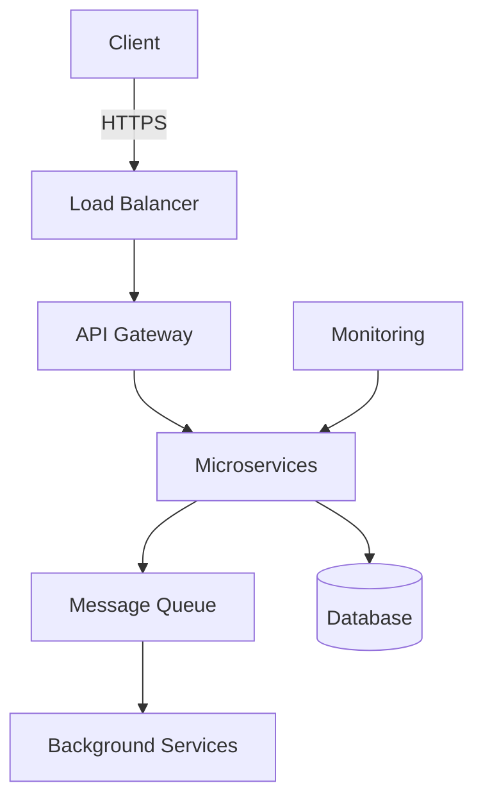

# Developer Portfolio

Building scalable, production-ready applications with modern technologies and best practices.

## Core Technologies

**Backend & Infrastructure**
- **Go** - High-performance microservices and concurrent systems
- **TypeScript/JavaScript** - Full-stack web applications
- **Python** - ML pipelines and automation
- **Docker & Kubernetes** - Container orchestration at scale

**Data & APIs**
- **PostgreSQL, MongoDB, Redis** - Database design and optimization
- **gRPC & REST** - Efficient API development
- **Event-driven architecture** - Scalable distributed systems

**DevOps & Cloud**
- **CI/CD with GitHub Actions** - Automated deployment pipelines
- **AWS/GCP/Azure** - Cloud infrastructure
- **Prometheus & Grafana** - Monitoring and observability

## What I Build

**Microservices Architecture**
Designing distributed systems with service mesh, API gateways, and event streaming for high availability and scalability.

**Cloud-Native Applications**
Kubernetes-native solutions with custom operators, serverless functions, and multi-cloud deployment strategies.

**ML & AI Systems**
End-to-end machine learning pipelines from training to production deployment, including RAG systems and model fine-tuning.

**High-Performance APIs**
gRPC services with Protocol Buffers, GraphQL implementations, and real-time communication systems.

## Development Philosophy

- **Test-driven development** with comprehensive testing strategies
- **Infrastructure as Code** using Terraform and automated provisioning
- **Zero-downtime deployments** with blue-green strategies and rollback mechanisms
- **Observability-first** approach with structured logging and metrics

## System Architecture

Ready to collaborate on innovative solutions for complex technical challenges.
